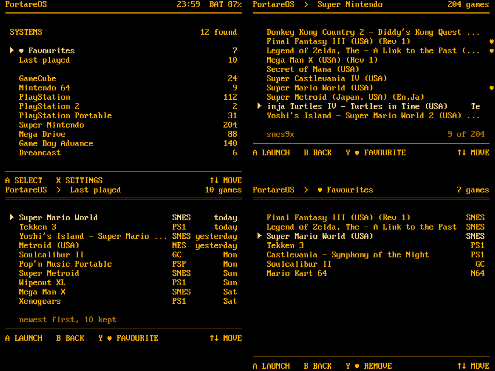
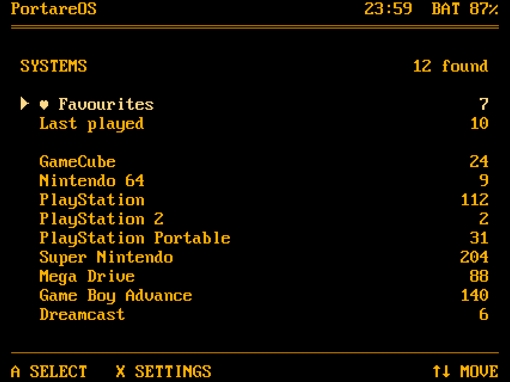
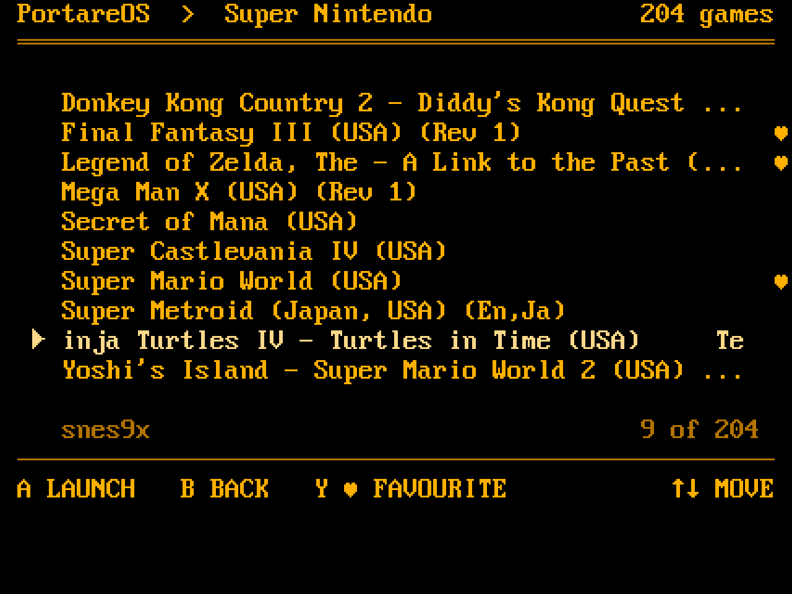
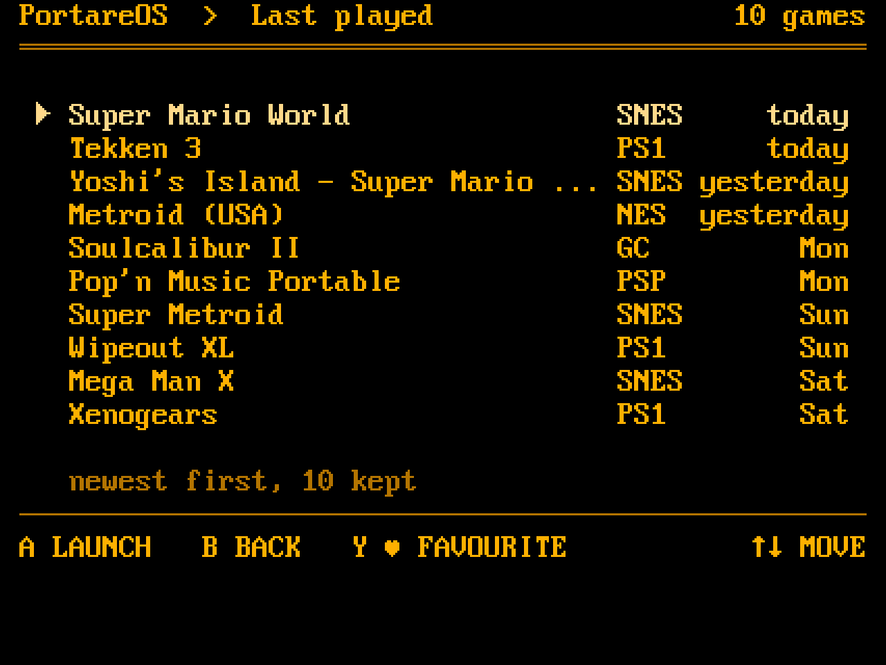
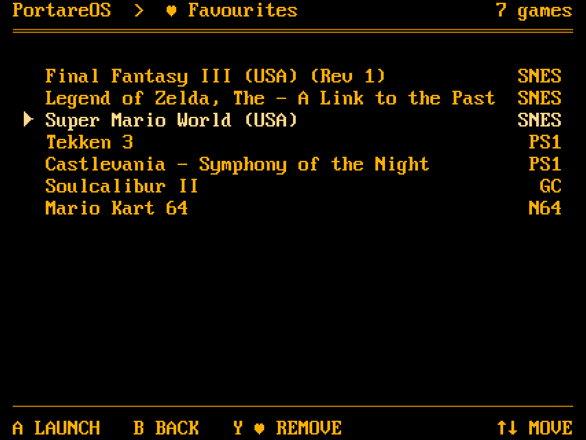

# Launcher: favourites, last played, long titles

A tester who filled several systems asked for two things: a way back to a
game without scrolling the whole list, and titles that do not stop at the
edge of the panel. This is the proposed shape, drawn at the launcher's real
grid: the VGA 8x16 font at 3x, 53 columns by 20 rows on the 1280x960 panel,
the amber palette. The images were generated from `font8x16.h`, so every
row fits as shown.

## Two pinned lists on the Systems screen

`♥ Favourites` and `Last played` sit above the systems, separated by a
blank row, with their counts on the right like any system. They are lists
of games across systems, so each row carries the system on the right.

- **Favourites** is a file, one game path per line, in
  `/storage/.config/portarelauncher/favourites`. `Y` toggles the selected
  game anywhere a game is listed; in the Favourites view the hint reads
  `Y ♥ REMOVE`. A favourite shows `♥` in the last column of its row in the
  system's own list.
- **Last played** holds the ten most recent launches, newest first, with
  the system and the day (`today`, `yesterday`, then the weekday). The
  launcher writes it at launch, since it is what runs `runemu`; nothing in
  the emulators changes. A game that fails to start is not recorded.

## Long titles

The list column is 46 characters wide once the marker and the `♥` column
are taken. A title longer than that is cut to the column with `...` while
it is not selected. The selected row scrolls instead: after a one second
pause it moves one column to the left every 150 ms, wraps with five spaces
between the end and the start, and resets when the selection moves. Only
the selected row ever moves, so the list stays still while scrolling
through it.

## The two views

The launcher lives in `portare-ch/portarelauncher`; its `tools/mockup.py`
is the text mockup at the same grid and should gain these screens when the
feature is built, so the layout cannot drift from what it claims.
